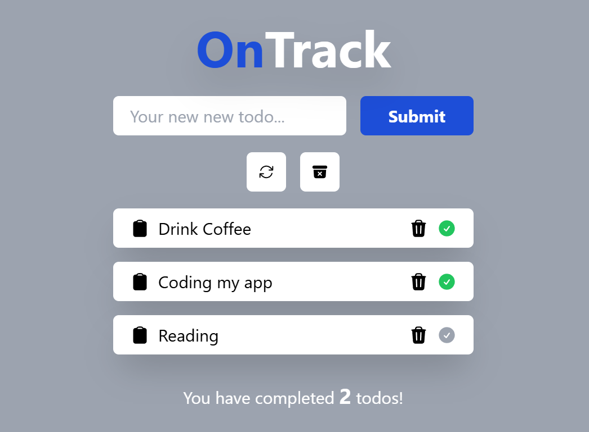

# OnTrack App

## Description

The project is a simple web application "Todo List" developed using Vue 3 and modern web technologies. Users can add, delete tasks, and mark them as completed. The application is designed for desktop devices only and uses Tailwind CSS for styling.

## Technologies that have been used

- HTML5
- CSS3
- TAILWIND
- VUE 3
- GIT

## Instructions for working with the project

1. Cloning a repository. You need to write `git clone https://github.com/boikoua/vue_on-track` in terminal.

2. Go to the project folder `cd vue_on-track`.

3. Check the node version. The version of node should be `v20.x.x`. To do this, type the command `node -v` in the terminal.

4. Install dependencies. To do this, enter the `npm install` command.

5. Run the project. To do this, enter the `npm run dev` command.
   After that the project will be available to you at `http://http://localhost:5173/`.

## View project

> Link to the project
> [DEMO LINK](https://boikoua.github.io/vue_on-track/).

## Preview

